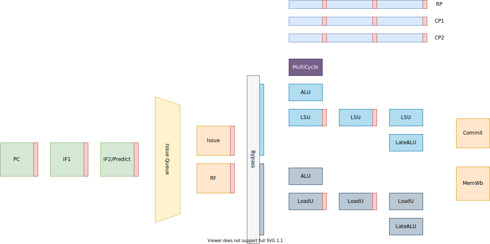

# Violet

Violet is a dual-issue superscalar RISC-V processor for educational purpose, written in [Clash](https://github.com/clash-lang/clash-compiler).

## Features

- RV32IM
- 7-stage superscalar pipeline with in-order issue and out-of-order commit
- BTB + GShare branch prediction
- 110 MHz on Artix-7
- 3.46 CoreMark/MHz
- Configurable

## Architecture

## Plans

- [ ] Implement RISC-V Privileged Architecture v1.12.
- [ ] Instruction and data caches.
- [ ] Boot Linux.

## Verification

Violet is verified using cosimulation with a software model written in Rust. Verification isn't extensive though - currently
only a small set of programs are tested. Don't tape out Violet yet :)
